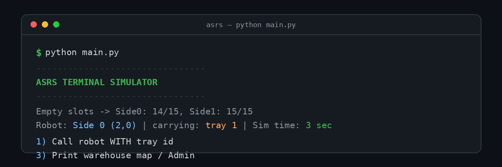
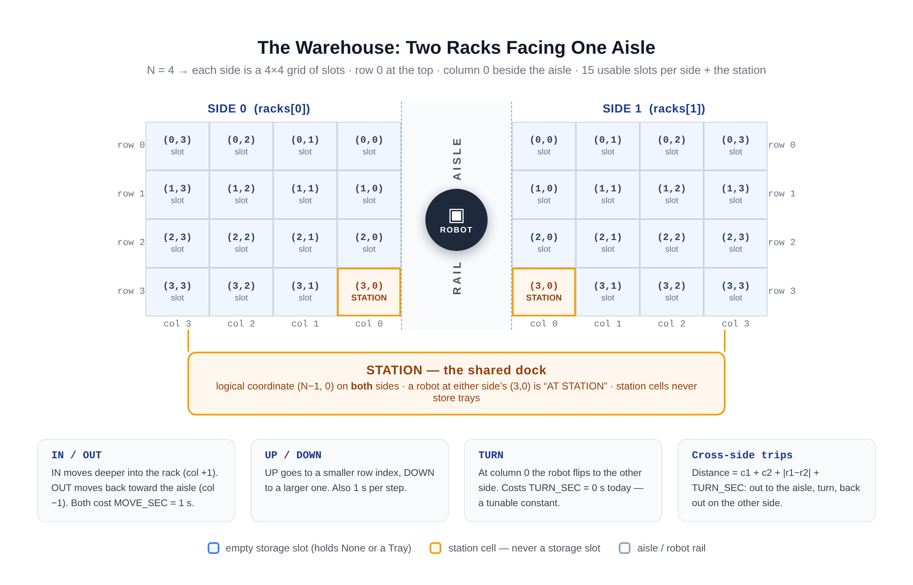
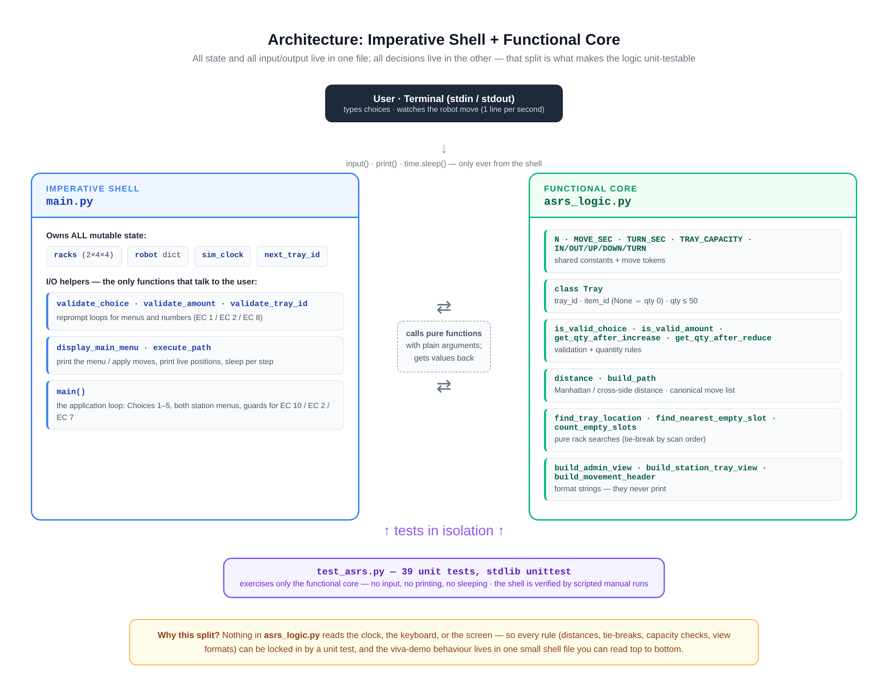
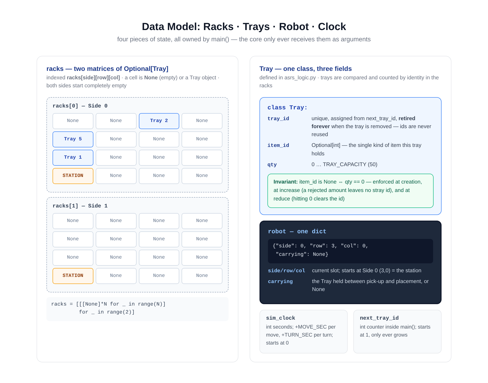
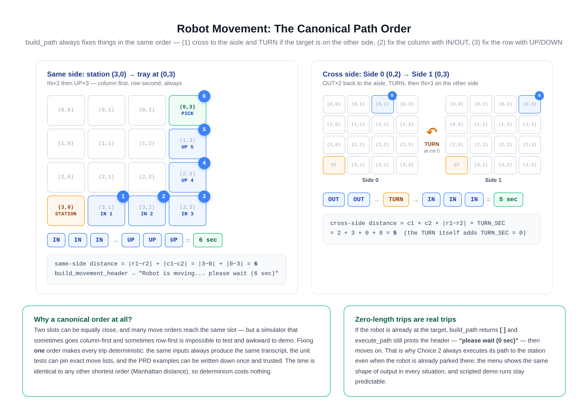
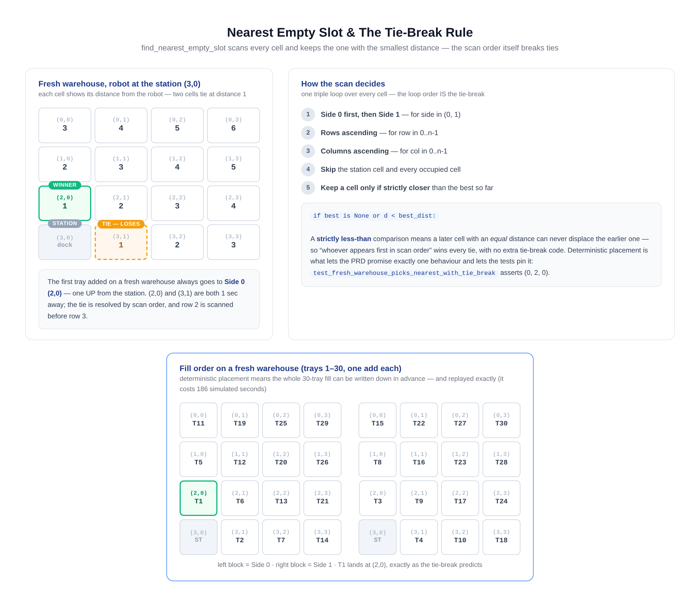
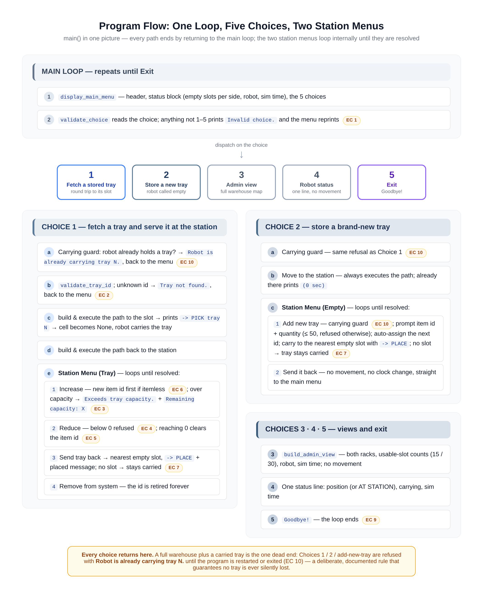

<a id="top"></a>

<div align="center">
  

  <h1>ASRS Terminal Simulator</h1>

  <p><strong>A command-line simulation of an Automated Storage &amp; Retrieval System.</strong><br>
  One robot · two 4×4 racks facing each other across an aisle · one shared picking station.<br>
  Trays come to the station, items go in and out, and the robot puts everything back in the
  <em>nearest</em> free slot — every second of travel simulated live in your terminal.</p>

  <p>
    
    
    
    
    
  </p>

  <p><sub><strong>2</strong> source files · <strong>39</strong> unit tests · <strong>6</strong> diagrams ·
  <strong>10</strong> documented edge cases · <strong>0</strong> possible tracebacks</sub></p>
</div>

---

## 🔖 Navigate

| Getting started | Under the hood | Behaviour | Quality |
|---|---|---|---|
| [Features](#features) · [Quick start](#quick-start) · [Repository layout](#repository-layout) | [Warehouse model](#warehouse-model) · [Architecture](#architecture) · [Data structures](#data-structures) | [Movement & timing](#movement-timing) · [Nearest slot](#nearest-slot--tie-break) · [Program flow](#program-flow) · [Menus](#menu-reference) · [Edge cases](#edge-cases) | [Example session](#example-session) · [Testing](#testing) · [Design decisions](#design-decisions) · [Docs](#documentation) |

---

<a id="features"></a>
## ✨ Features

| | What you get |
|:---:|---|
| 🤖 | **Live robot travel** — every move prints the robot's position and sleeps one real second, so a 6-slot trip takes 6 seconds of wall time and blocks input naturally |
| 🗄️ | **Two 4×4 racks, 30 usable slots** — managed as N×N matrices, with a shared station dock that never stores trays |
| 🎯 | **Deterministic placement** — returned and new trays always go to the *nearest* empty slot, with a documented tie-break (Side 0 before Side 1, then row, then column) |
| 🔄 | **Full station workflow** — increase / reduce items with capacity checks, send the tray back, or retire it from the system; tray ids are never reused |
| 🗺️ | **Admin view** — a complete warehouse map with per-side empty-slot counts, robot status, and the simulated clock |
| 🛡️ | **Bulletproof input** — nothing the user can type raises a traceback; invalid input reprompts; an ended input stream exits cleanly with `Goodbye!` |
| 🧪 | **39 unit tests** locking in every rule of the pure logic core |

<p align="right"><a href="#top">back to top ⬆️</a></p>

<a id="quick-start"></a>
## 🚀 Quick start

```bash
# run the simulator
python code/main.py

# run the test suite (39 tests)
python code/test_asrs.py
# or: python -m unittest code/test_asrs.py -v
```

> No installation, no virtual environment, no third-party packages.
> If you have **Python 3.8+**, you are done — the whole program is standard library.

<p align="right"><a href="#top">back to top ⬆️</a></p>

<a id="repository-layout"></a>
## 📦 Repository layout

```
ASRS-terminal-simulator-main/
├── code/
│   ├── main.py
│   ├── asrs_logic.py
│   └── test_asrs.py
├── README.md
├── docs/
│   ├── PRD.md
│   └── Design_Document.md
└── diagrams/
    ├── banner.png
    ├── warehouse_layout.png
    ├── architecture.png
    ├── data_model.png
    ├── movement_example.png
    ├── nearest_slot_tiebreak.png
    └── program_flow.png
```

<p align="right"><a href="#top">back to top ⬆️</a></p>

---

<a id="warehouse-model"></a>
## 🗺️ The warehouse model



The world is deliberately small and fully deterministic:

| Concept | Value | Notes |
|---|---|---|
| Rack size | `N = 4` (4×4 per side) | configurable in one place (`asrs_logic.N`) |
| Usable slots | 15 per side, **30 total** | the station cell (3,0) never stores a tray |
| Move cost | `MOVE_SEC = 1` second | one step = one slot, printed live |
| Turn cost | `TURN_SEC = 0` seconds | a separate constant, ready to be tuned |
| Tray capacity | `TRAY_CAPACITY = 50` items | a tray holds exactly one item id |
| Robot start | Side 0, (3,0) — the station | carrying nothing, `sim_clock = 0` |

Coordinates are `(row, col)` with **row 0 at the top** and **column 0 beside the aisle**. `IN` moves deeper into the rack (col + 1), `OUT` returns toward the aisle (col − 1), `UP`/`DOWN` change the row, and `TURN` flips sides at column 0.

<p align="right"><a href="#top">back to top ⬆️</a></p>

<a id="architecture"></a>
## 🧱 Architecture: functional core, imperative shell



The program is split into exactly two source files, and the boundary is strict:

- **`asrs_logic.py` — the functional core.** Pure functions only: no `input()`, no `print()`, no `time.sleep()`, no hidden state. Every function takes plain arguments and returns a value. This file contains every *decision* the program makes: what counts as valid input, how far away a slot is, what the canonical path looks like, which slot is nearest, and what each screen should say.
- **`main.py` — the imperative shell.** It owns all four pieces of mutable state (the racks, the robot dict, `sim_clock`, `next_tray_id`) and performs every side effect: reading keys, printing lines, sleeping. It never decides anything itself — it sequences the core's functions around its state.

Why bother, in a program this small? Because the split is what makes the logic **unit-testable**: a function that cannot touch the keyboard or the clock can be called from a test with hand-built racks and asserted against exact expected values. That is why `test_asrs.py` can pin down the tie-break, the distance formulas, and every output format without simulating a single keystroke — and why the shell, which is genuinely interactive, is verified with scripted manual runs instead.

<p align="right"><a href="#top">back to top ⬆️</a></p>

<a id="data-structures"></a>
## 🧮 Data structures



Everything the program remembers fits in four variables, all created inside `main()`:

```python
racks = [[[None] * N for _ in range(N)] for _ in range(2)]   # racks[side][row][col]
robot = {"side": 0, "row": N - 1, "col": 0, "carrying": None}
sim_clock = 0        # simulated seconds elapsed
next_tray_id = 1     # only ever increments — ids are retired, never reused
```

A cell is `None` (empty) or a `Tray(tray_id, item_id, qty)`. One invariant is maintained everywhere a quantity is assigned:

> **`item_id` is `None` if and only if `qty == 0`.**

It holds at creation (a tray added with quantity 0 is stored itemless), at increase (an item id prompted this turn is only committed if the increase succeeds — a rejected amount can never leave a stray id on an empty tray), and at reduce (reaching exactly 0 clears the item id).

<p align="right"><a href="#top">back to top ⬆️</a></p>

---

<a id="movement-timing"></a>
## ⏱️ Robot movement and timing



Distances are Manhattan-style, because the robot moves one slot at a time along the grid:

| Case | Formula |
|---|---|
| Same side | `|r1 − r2| + |c1 − c2|` |
| Cross side | `c1 + c2 + |r1 − r2| + TURN_SEC` — out to the aisle, turn, back out on the other side |

`build_path()` always emits moves in the **canonical order** — (1) cross to the aisle and `TURN` if needed, (2) fix the column with `IN`/`OUT`, (3) fix the row with `UP`/`DOWN` — so the same request always produces the same transcript. If the robot is already at the target, the path is simply `[]` and the movement header prints `(0 sec)`; that is why Choice 2 always "moves" to the station even when it is already parked there.

The seconds shown in `Robot is moving... please wait (X sec)` are computed per step — `MOVE_SEC` for every move plus `TURN_SEC` for every `TURN` — rather than `len(path) × MOVE_SEC`, so turning stays free *because* `TURN_SEC` is 0, not by accident. Change the constant and every number stays consistent.

<p align="right"><a href="#top">back to top ⬆️</a></p>

<a id="nearest-slot--tie-break"></a>
## 🎯 Nearest empty slot and the tie-break



When a tray needs a home, `find_nearest_empty_slot()` scans **every** cell of both racks and keeps the empty, non-station cell with the smallest distance. Ties are resolved by the scan order itself — Side 0 before Side 1, rows ascending, columns ascending — using a *strictly less-than* comparison, so an equally close cell found later can never displace an earlier one.

Concretely: from a fresh station, `(2,0)` and `(3,1)` are both 1 second away, but row 2 is scanned first, so **the first tray always lands at Side 0 (2,0)**. Because placement is deterministic, the entire 30-tray fill of an empty warehouse can be written down in advance (it costs 186 simulated seconds) — the fill order is shown in the figure above.

<p align="right"><a href="#top">back to top ⬆️</a></p>

<a id="program-flow"></a>
## 🔁 Program flow



One `while True` loop in `main()` shows the menu, reads a choice, and dispatches. Choices 1 and 2 each open a **station menu** that loops internally until it is resolved (send-back, remove, or placement). Every path eventually returns to the main loop.

The one deliberate dead end: if the warehouse is completely full **and** the robot is left carrying a tray (a placement failed with EC 7), Choices 1, 2, and "Add new tray" are refused with `Robot is already carrying tray N.` until the program exits. This rule guarantees no carried tray is ever silently overwritten or lost — see EC 10.

<p align="right"><a href="#top">back to top ⬆️</a></p>

---

<a id="menu-reference"></a>
## 📋 Menu reference

**Main menu** (shown before every choice, with a live status block):

| Choice | Action | Moves the robot? |
|:---:|---|---|
| `1` | Call robot WITH tray id — fetch, serve at the station | yes: to the slot, then back to the station |
| `2` | Call robot EMPTY — add a brand-new tray, or send it back | to the station; to a slot if a tray is added |
| `3` | Print warehouse map / Admin | no |
| `4` | Robot status | no |
| `5` | Exit | no |

**Station Menu (Tray)** — after Choice 1 fetches a tray:

| Choice | Action | Rules |
|:---:|---|---|
| `1` | Increase items | new item id prompted first if the tray is itemless (EC 6); rejects above 50 with `Remaining capacity: X` (EC 3) |
| `2` | Reduce items | rejects below 0 (EC 4); reaching exactly 0 clears the item id (EC 5) |
| `3` | Send tray back | robot carries it to the nearest empty slot (EC 7 if none) |
| `4` | Remove tray from system | the tray id is retired forever |

**Station Menu (Empty)** — after Choice 2:

| Choice | Action | Rules |
|:---:|---|---|
| `1` | Add new tray | item id + quantity (≤ 50); auto-assigned next id; placed in the nearest empty slot (EC 7 if none) |
| `2` | Send it back | no movement, no clock change — straight back to the main menu |

<p align="right"><a href="#top">back to top ⬆️</a></p>

<a id="edge-cases"></a>
## 🛡️ Edge cases and error messages

Every case below is printed verbatim by the program; the numbering maps to the PRD's EC list.

| # | Situation | Message / behaviour |
|:---:|---|---|
| EC 1 | Choice is not 1–5 | `Invalid choice.` and the menu reprints |
| EC 2 | Tray ID not found (Choice 1) | `Tray not found.` — back to the main menu, no movement |
| EC 3 | Increase exceeds capacity | `Exceeds tray capacity.` + `Remaining capacity: X`, station menu re-shows |
| EC 4 | Reduce below 0 | `Quantity cannot go below 0.`, station menu re-shows |
| EC 5 | Reduce to exactly 0 | Allowed; item id becomes `None` |
| EC 6 | Increase on an itemless tray | Prompts for the item id first |
| EC 7 | No empty slot for placement | `No empty slots available.` — tray stays carried, station menu re-shows |
| EC 8 | Non-integer / empty input | `Invalid input.` (or `Invalid choice.` at menus) and reprompt — never a traceback; ended input exits with `Goodbye!` |
| EC 9 | Choice 5 | `Goodbye!` and the program ends |
| EC 10 | Fetch/store while already carrying (full warehouse) | `Robot is already carrying tray N.` — a documented dead end until Exit |

<p align="right"><a href="#top">back to top ⬆️</a></p>

---

<a id="example-session"></a>
## 💻 Example session

Add the first tray, fetch it back, hit the capacity wall, then put it away — four minutes of
typical use condensed into one transcript (movement sleeps trimmed for print; each `[t=Ns]`
line appears one second apart in a real run):

```text
$ python code/main.py
--------------------------------
ASRS TERMINAL SIMULATOR
--------------------------------
Empty slots -> Side0: 15/15, Side1: 15/15
Robot: Side 0 (3,0) AT STATION | carrying: none | Sim time: 0 sec
--------------------------------
1) Call robot WITH tray id
2) Call robot EMPTY
3) Print warehouse map / Admin
4) Robot status
5) Exit
Enter choice: 2
Robot is moving... please wait (0 sec)
--------------------------------
STATION MENU (EMPTY)
--------------------------------
1) Add new tray
2) Send it back
Enter choice: 1
Item ID: 101
Quantity (%): 30
Robot is moving... please wait (1 sec)
[t=1s] robot at Side 0 (2,0)
-> PLACE tray 1
Tray 1 placed at Side 0 (2,0)
```

The first tray lands at Side 0 (2,0) — one step from the station, exactly as the tie-break rule predicts. Now we fetch it back and work on it at the station:

<details>
<summary><b>📷 Continue — fetch, EC 3 in action, send-back, admin view, exit</b></summary>

```text
Enter choice: 1
Tray ID: 1
Robot is moving... please wait (0 sec)      <- robot is already at (2,0), so 0 sec
-> PICK tray 1
Robot is moving... please wait (1 sec)
[t=2s] robot at Side 0 (3,0)
--------------------------------
STATION MENU (TRAY)
--------------------------------
Tray ID: 1
Item ID: 101
Qty: 30 / 50
--------------------------------
1) Increase items
2) Reduce items
3) Send tray back
4) Remove tray from system
Enter choice: 1
Add quantity: 15
(Station Menu (Tray) reprints, now showing Qty: 45 / 50)
Enter choice: 1
Add quantity: 15
Exceeds tray capacity.
Remaining capacity: 5
(Station menu reprints, still Qty: 45 / 50)
Enter choice: 3
Robot is moving... please wait (1 sec)
[t=3s] robot at Side 0 (2,0)
-> PLACE tray 1
Tray 1 placed at Side 0 (2,0)
```

Note the two `-> PLACE` decisions landing on the same slot `(2,0)` both times: after the pick-up the slot became empty again, and it is still the nearest one to the robot. Finish with the admin view and exit:

```text
Enter choice: 3
--------------------------------
WAREHOUSE MAP
--------------------------------
SIDE 0                                    SIDE 1
T1:I101(q45)  EMPTY        EMPTY        EMPTY        EMPTY        EMPTY        EMPTY        EMPTY
EMPTY        EMPTY        EMPTY        EMPTY        EMPTY        EMPTY        EMPTY        EMPTY
EMPTY        EMPTY        EMPTY        EMPTY        EMPTY        EMPTY        EMPTY        EMPTY
STATION      EMPTY        EMPTY        EMPTY        STATION      EMPTY        EMPTY        EMPTY
--------------------------------
Empty slots -> Side0: 14/15, Side1: 15/15 (total 29/30)
Robot: Side 0 (2,0) | carrying: none
Sim time: 3 sec
--------------------------------
Enter choice: 5
Goodbye!
```

</details>

<p align="right"><a href="#top">back to top ⬆️</a></p>

<a id="testing"></a>
## 🧪 Testing

```bash
$ python code/test_asrs.py
...
----------------------------------------------------------------------
Ran 39 tests in 0.002s

OK
```

The suite covers the functional core only — that is the point of the architecture:

- **Tray** — attribute storage, the itemless/qty-0 state.
- **Input predicates** — in-range / out-of-range / non-integer / negative cases for both validators.
- **Quantity rules** — increase up to and beyond 50, reduce to and below 0 (boundaries included).
- **Distance & paths** — Manhattan arithmetic, the cross-side formula, the canonical `IN×3 → UP×3` order, `TURN` insertion, zero-length paths.
- **Placement** — the fresh-warehouse tie-break `(0,2,0)`, occupied-cell skipping, station exclusion, `None` on a full warehouse, and `find_tray_location` lookups.
- **Views** — admin map content, usable-slot counts (`15/15`, `30/30`), movement-header timing (turns add `TURN_SEC`, not `MOVE_SEC`), adaptive column spacing with long ids.

The interactive shell is verified separately with scripted full-program replays (input piped in, `time.sleep` patched out), which walk the PRD's test-case table and every edge case, including the full-warehouse EC 10 dead end.

<p align="right"><a href="#top">back to top ⬆️</a></p>

---

<a id="design-decisions"></a>
## 🧠 Design decisions at a glance

| Decision | Alternative rejected | Why |
|---|---|---|
| Pure core + imperative shell | One file with logic and I/O mixed | only pure functions can be unit-tested in isolation; the shell stays small enough to read top-to-bottom |
| `dict` for the robot | a `Robot` class | four fields, no methods of its own — a dict is transparent, trivial to build in tests, and shows up nicely in the status line |
| Nested lists for racks | a dict keyed by `(side,row,col)` | the grid *is* the domain model; `racks[side][row][col]` reads exactly like the math, and scans are simple nested loops |
| `None` as the empty slot / itemless sentinel | sentinel objects or flags | `None` is falsy, printable, and idiomatic; the one invariant (`item_id is None ⇔ qty == 0`) is enforced at all three assignment sites |
| Strict `<` in the nearest-slot scan | `<=` plus explicit tie-break code | the scan order already *is* the tie-break — strictly-less keeps the earliest cell on ties for free |
| `TURN_SEC` as a constant (currently 0) | hardcoding "turns are free" | timing stays tunable, and the movement header sums per-step costs so every number remains consistent if it changes |
| Tray ids retired, never reused | id recycling | a removed tray's history can never be confused with a new tray's — cheap to implement, impossible to undo later |
| Refuse work while carrying (EC 10) | silently replacing the carried tray | replacing would lose trays invisibly; refusing makes the full-warehouse state explicit and debuggable |

<p align="right"><a href="#top">back to top ⬆️</a></p>

<a id="documentation"></a>
## 📚 Documentation

- [`docs/PRD.md`](docs/PRD.md) — product requirements: interface, FR 1–3, edge cases EC 1–10, and the test-case table *(delivered as `PRD.pdf` alongside this repo)*.
- [`docs/Design_Document.md`](docs/Design_Document.md) — terminology and formulae, file organization, program flow, function signatures, and function-level algorithms *(delivered as `Design_Document.pdf`)*.
- **`ASRS_Code_Study_Guide.pdf`** *(delivered next to this repo)* — a line-by-line walkthrough of every function in all three files, with worked traces and a 25-question viva Q&A bank.

<p align="right"><a href="#top">back to top ⬆️</a></p>

<a id="future-extension"></a>
## 🔮 Possible future extension

The simulator is intentionally ephemeral — a fresh `python main.py` always starts from two empty racks, exactly as the PRD specifies. A natural extension (currently out of scope) would be optional **state persistence** via a small SQLite layer (`python main.py warehouse.db`): two tables (`trays`, plus a key/value `state` table for the clock, robot position, and next id), populated with basic `CREATE TABLE / INSERT / SELECT / UPDATE / DELETE` only. The functional core would remain untouched — persistence would be a third, purely imperative module beside `main.py` — and it would let demos jump straight to interesting warehouse states instead of waiting through a 186-second fill. Whether to build it is pending a decision on scope.

<p align="right"><a href="#top">back to top ⬆️</a></p>

---

<div align="center">
  <sub>Functional core · imperative shell · 39 tests · 0 dependencies</sub>
  <br>
  <sub>Built to be read as much as run — start with <a href="#architecture">the architecture</a>.</sub>
</div>
